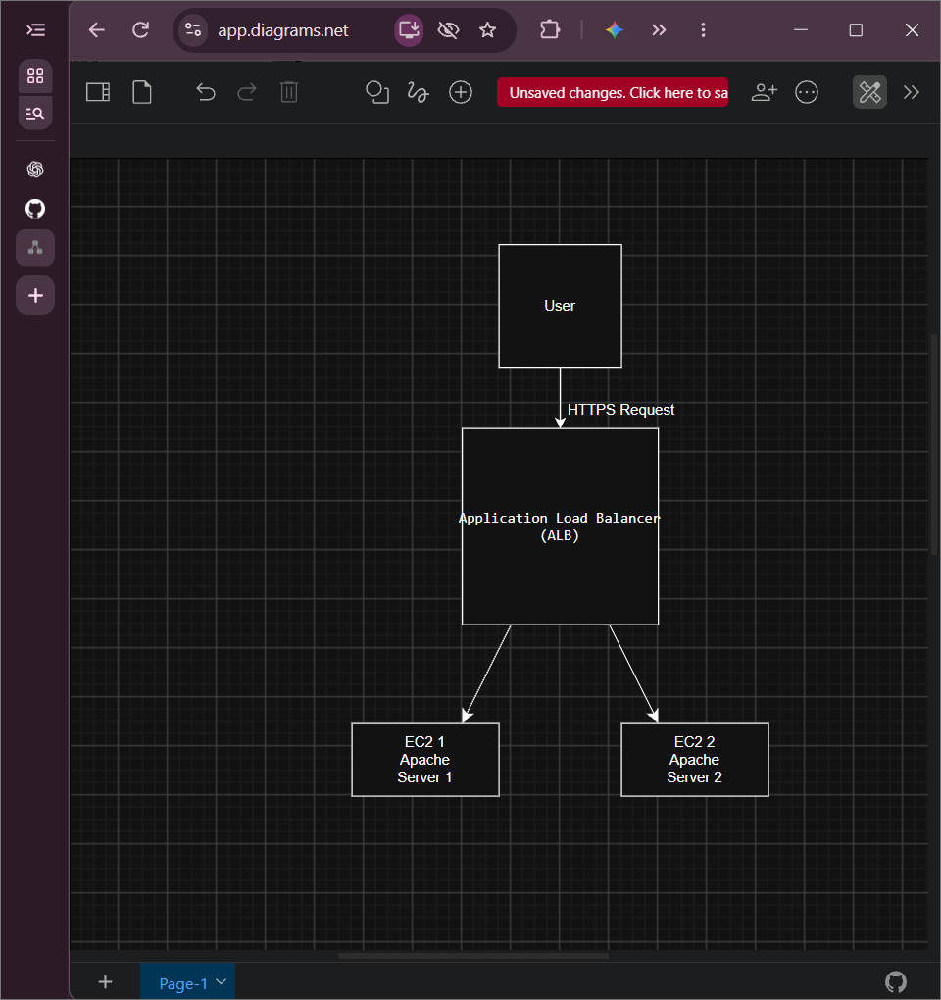
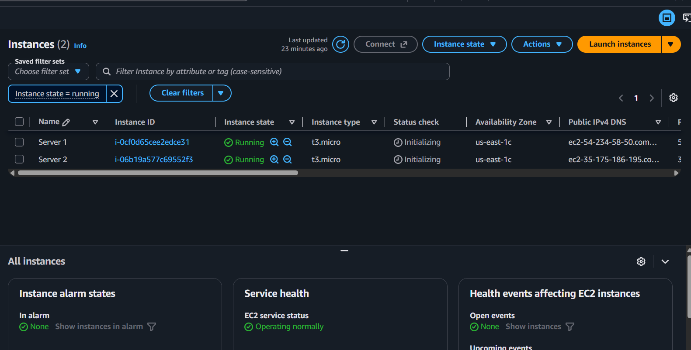
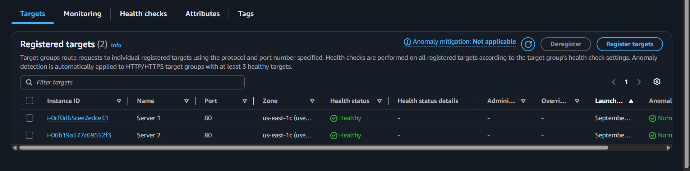
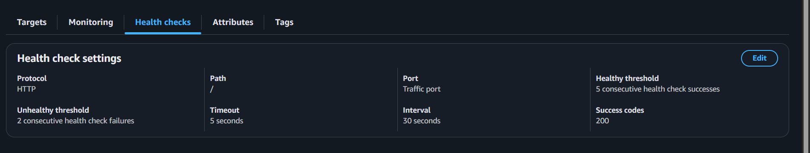
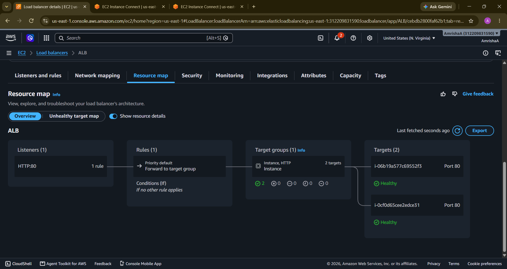
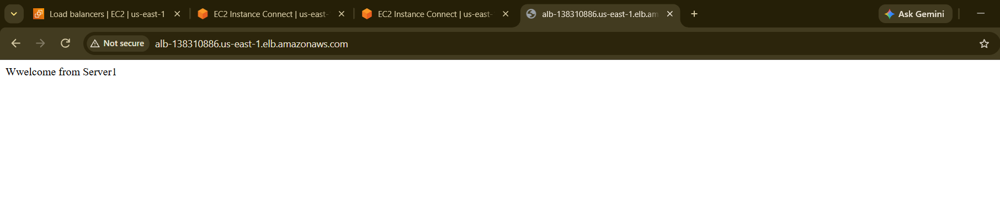
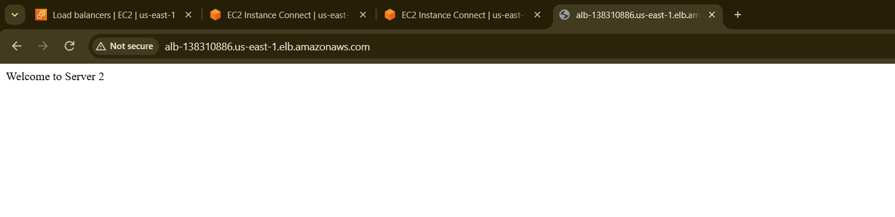

# AWS Application Load Balancer (ALB) Project

Deploying a highly available web application using Amazon EC2 and an Application Load Balancer.

This project demonstrates how I deployed two Apache web servers on separate Amazon EC2 instances and distributed incoming traffic using an Application Load Balancer (ALB). The ALB performs health checks and routes traffic only to healthy instances, ensuring high availability and fault tolerance.

## Architecture

## AWS Services & Tools Used

- Amazon EC2
- Application Load Balancer (ALB)
- Target Groups
- Security Groups
- Amazon Linux
- Apache HTTP Server
- EC2 Instance Connect
- Git
- GitHub

## What I Did

1. Launched two Amazon Linux EC2 instances.
2. Configured Security Groups with SSH (22) and HTTP (80).
3. Connected to both instances using EC2 Instance Connect.
4. Installed Apache HTTP Server on both servers.
5. Created separate webpages for Server 1 and Server 2.
6. Created a Target Group and registered both EC2 instances.
7. Configured health checks for the Target Group.
8. Created an Internet-Facing Application Load Balancer.
9. Attached the Target Group to the Load Balancer.
10. Verified traffic distribution between both servers.
11. Tested fault tolerance by stopping one instance and verifying traffic routing to the healthy server.
12. Documented the setup with screenshots and an architecture diagram.

## Apache Installation

I used the following commands to install and start Apache on both EC2 instances:

## Screenshots

### EC2 Instances

### Target Group

### Health Checks

### Application Load Balancer

### Server 1 Output

### Server 2 Output

## What I Learned

- Launching and configuring multiple EC2 instances
- Installing and managing Apache Web Server
- Creating and configuring Target Groups
- Configuring Application Load Balancers
- Understanding Health Checks
- Load Balancing concepts
- High Availability and Fault Tolerance
- AWS Security Groups
- Using Git and GitHub for version control

## Cleanup

The EC2 instances, Target Group, and Application Load Balancer should be deleted after testing to avoid unnecessary AWS charges.
